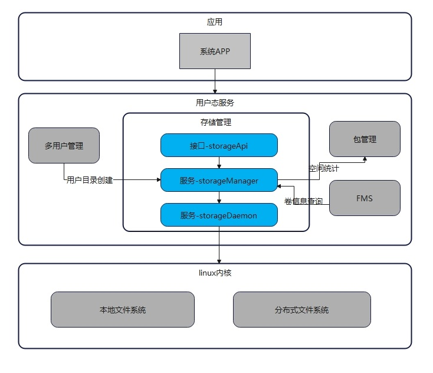

# storage_storage_manager

#### 介绍
StorageManager部件提供外置存储卡挂载管理、文件加解密、磁盘和卷的查询与管理、用户目录管理和空间统计等功能，为系统和应用提供基础的存储查询、管理能力。

部件上下文：



部件描述：

|  **部件名称**   | **简介**                                 |
|  -------------  | ---------------------------------------- |
| StorageApi      | 为应用提供一套查询、管理存储和用户的接口API |
| StorageManager  | 监听并接收设备、用户的上下线的消息管理和广播分发；负责提供卷、磁盘的相关查询能力和管理策略、接口；负责提供多用户目录创建接口；负责提供针对应用、用户为维度的存储空间统计。 |
| StorageDaemon   | 提供分区挂载能力，及与内核层的交互能力、设备上下线监听能力及目录加解密能力。|

外部依赖描述：
|  **部件名称**   | **简介**                                 |
|  -------------  | ---------------------------------------- |
| 多用户管理      | 负责管理用户，并调用storageManager提供的能力管理相应用户的数据目录。 |
| 包管理          | 负责提供包的管理功能。为storagemanager提供指定用户、指定包名对应的空间大小。 |
| FMS            | 负责提供对文件的管理功能。需要storageManager提供的卷信息。 |

#### 目录
```
/foundation/storage/storage_manager
│── interface                   # 接口声明
│  ├── innerkits                # 对内接口声明
│  └── kits                     # 对外接口声明
│── services                    # 服务实现
│  ├── storage_manager          # 非常驻manager服务实现
│  └── storage_daemon           # 常驻daemon服务实现
```

#### 约束

1.  接口支持情况：
StorageDaemon所有接口仅支持storageManager服务进行调用。

#### 使用说明
1. 可以调用指定的native接口进行相应的用户数据目录创建/删除工作，在用户创建或删除完毕后，指定用户的目录会在创建成功/失败后创建/删除。